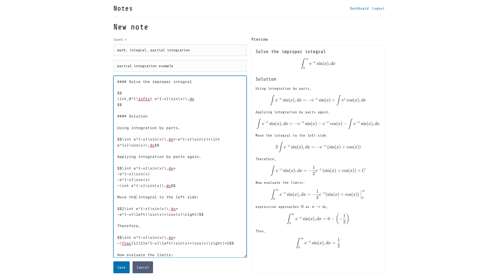

# MarkdownNotesLive

A note taking web app using flask, with live Markdown rendering and user authentication.



Dashboard search functions:
'''text
/t <tagname>
/c <content>
/n <title>
'''
searching without prefix includes content and title

## Installation

```bash
git clone https://github.com/almightyDavid/MarkdownNotesLive.git
cd MarkdownNotesLive
python -m venv .venv
source .venv/bin/activate
python -m pip install -r requirements.txt
python app.py
```

Open the application in your browser at:

```text
http://127.0.0.1:5000
```

## Windows

```powershell
git clone https://github.com/almightyDavid/MarkdownNotesLive.git
cd MarkdownNotesLive

py -m venv .venv
.venv\Scripts\Activate.ps1

python -m pip install -r requirements.txt
python app.py
```
